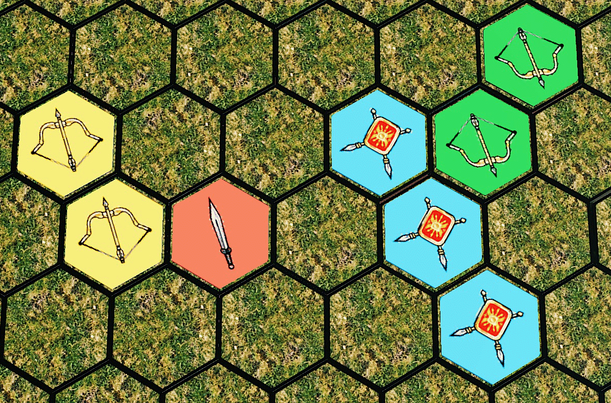

This is my most progressed board game design to date. Seating 2-4 players, the game plays on a differently shaped continent every time, built with modular hexagonal pieces.

The kingdom's power has broken up over a harsh winter, breaking up the power into several factions vying for dominance, each controlled by a player. Now, Spring has come and the brawl for dominance begins. The goal of the game is to unite 4 castles into a contiguous region of your own cards, to unite the broken kingdom under your rule. 

Each turn is simple: 
1. Place one card from your hand on any empty space, or replacing one of your existing cards.
2. Attack 1 opponent's card, placing it among your prisoners, if you're able.
3. Draw back up to 3 cards.

To attack a card, you must have a larger group of the card that beats the opponent's card. Bows beat swords, swords beat shields, and shields beat bows. In the example below, yellow would be able to capture Red's sword because it's next to two of yellow's bows. Similarly, blue would be able to capture either of green's bow cards because it has the larger group of shields adjacent.

This weapons triangle makes for a constantly shifting landscape where your soldiers have very decisive victories and losses.

Finally, you can use prisoners you've taken to your advantage. Release 1 to play any card you want this turn, or release 4 of a kind to take another turn.

That's pretty much the game! For further rules or to play on Tabletop Simulator, follow the links at the top. This game is still in development, so please contact me if you'd be interested in playtesting!
